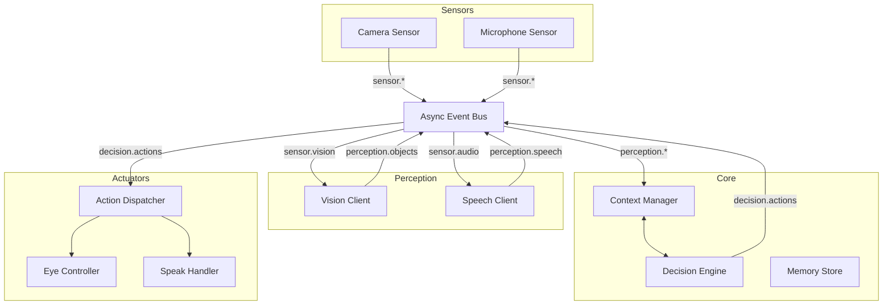

# Companion Robot — Agentic AI Runtime

An autonomous, agentic companion robot runtime built with a layered, event-driven architecture. The system is designed to perceive its environment via sensors, reason using locally-hosted AI models (LLMs, Vision, STT), and interact naturally with humans through speech and expressive animations.

## 🚀 Key Features

- **Event-Driven Architecture**: Decoupled sensor-perception-decision-action pipeline using an asynchronous event bus.
- **Agentic Autonomy**: Continuously operates as a living agent, not just a request-response program.
- **Local AI Integration**: Designed for locally-hosted vision recognition, voice-to-text, and decision-making LLMs.
- **Modular Hardware Support**: Pluggable sensors and actuators with a uniform service lifecycle.
- **Expressive Eyes**: Built-in OLED eye animation system for emotional feedback.
- **Hybrid Memory**: Short-term context ring buffer combined with persistent long-term storage.

---

## 🏗️ System Architecture

The robot follows a cognitive pipeline: **Sensor → Perception → Context → Decision → Action**.



### Why this architecture?

- **Decoupling**: Sensors and actuators operate at different frequencies without blocking each other.
- **Predictability**: The Decision LLM returns **structured action objects**, ensuring the robot only performs valid, safe behaviors.
- **Single Source of Truth**: The `ContextManager` maintains all current state (seen objects, conversation history, internal mood).

---

## 📂 Project Structure

```
robot/
├── main.py                  # Entry point (config → runtime)
├── runtime.py               # Central orchestrator & lifecycle manager
├── config.py                # Typed configuration dataclasses
├── core/                    # Event bus, context, and dispatch logic
├── sensors/                 # Hardware sensor adapters (Camera, Mic)
├── perception/              # AI API clients (Vision, Speech-to-Text)
├── decision/                # LLM context builder & reasoning engine
├── actions/                 # Structured action handlers (Speak, Eyes)
├── behaviors/               # Autonomous reflex behaviors (Idle Blink)
├── display/                 # OLED eye animation controller
├── memory/                  # Short and long-term memory store
└── utils/                   # Logging and retry helpers
```

---

## 🛠️ Getting Started

### Prerequisites
- Python 3.10+
- `luma.oled` and `PIL` (for display support)
- `asyncio`

### Installation
```bash
git clone https://github.com/Vlad-Andres/companion-robot-eva.git
cd companion-robot-eva
# Recommended: create a virtual environment
python -m venv venv
source venv/bin/activate
pip install -r requirements.txt  # If available
```

### Running the Robot
```bash
python main.py
```

### Configuration
Runtime parameters (API URLs, sensor intervals, hardware ports) are managed in `config.py`. You can also provide a YAML config (feature in progress).

---

## 🧩 Extensibility

The system is designed for growth. Here is how to add new capabilities:

| To add... | Do this |
|---|---|
| **New Sensor** | Subclass `BaseSensor`, register in `runtime.py`, and publish to a new `sensor.*` topic. |
| **New AI Model** | Subclass `BasePerceptionClient`, subscribe to a sensor topic, and update `ContextManager`. |
| **New Action** | Add a type to `ActionType`, define a payload in `action_types.py`, and write a `BaseActionHandler`. |
| **Autonomous Behavior** | Add a new service in `behaviors/` that publishes actions based on internal timers or sensor triggers. |

---

## 🗺️ Implementation Roadmap

The current codebase is a fully functional architecture scaffold with hardware/API stubs.

- [ ] **Camera Integration**: Implement OpenCV/picamera capture in `sensors/camera_sensor.py`.
- [ ] **Audio Integration**: Implement PyAudio/sounddevice in `sensors/microphone_sensor.py`.
- [ ] **Vision API**: Connect `perception/vision_client.py` to a local recognition model.
- [ ] **Decision Brain**: Connect `decision/decision_engine.py` to a local LLM (e.g., Ollama/LM Studio).
- [ ] **Speech Synthesis**: Implement TTS in `actions/speak_handler.py`.
- [ ] **Vector Memory**: Upgrade `memory/memory_store.py` to use a vector database for semantic recall.

---

## 📄 License
Check the `LICENSE` file for details (default: MIT).
