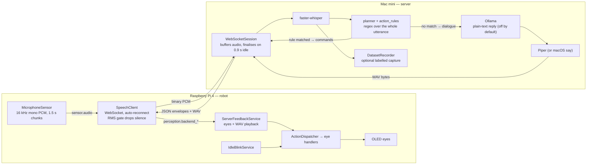

# Architecture

Eva is split across two machines. The **robot** (Raspberry Pi 4) owns hardware, reflexes and
execution. The **server** (Mac mini) owns everything expensive: speech recognition, language
models, speech synthesis. They talk over one WebSocket session on the local network.

The split exists because a Pi 4 running a language model manages a few tokens per second while
pegging the CPU that also has to drive motors — and it drains the battery faster than streaming
audio over WiFi ever would. Keeping the Pi thin is what makes Eva fast.

This page has two halves. **[What runs today](#what-runs-today)** describes the code as it exists;
**[Where this is going](#where-this-is-going)** describes the design being built toward. Nothing in
the second half is implemented yet — check [roadmap.md](roadmap.md) for the order of work.

---

## What runs today

**One turn, end to end.** The microphone publishes `sensor.audio` chunks on the event bus. The
SpeechClient drops near-silence with an RMS check and streams the rest as binary frames. The server
appends them to a buffer and finalises the utterance after 0.9 s of quiet, transcribes it, and
tries the rule matcher. A match sends back command envelopes and ends the turn; no match hands the
text to Ollama, whose plain-text reply is synthesised and returned as WAV. The robot plays the WAV,
muting its own microphone while it does so, so Eva doesn't transcribe herself.

**What is deliberately simple right now.** There is one matching tier, not four. Endpointing is a
server-side idle timer, not a voice gate on the Pi. The language model is prompted for plain text
and is not constrained by the action registry. There is no arbiter, no epochs, and no capability
handshake — the robot executes whatever command arrives.

**What is real and worth keeping.** Components publish to topics on an async bus and never call
each other directly, so a slow network client can't block audio capture. Services with
`start()`/`stop()` are managed by `ServiceRegistry`: started in registration order, stopped in
reverse, and a failure is logged without taking the robot down — a missing display degrades one
service instead of the whole robot. Every command reaching the wire passes `validate_command()` in
`server/actions.py`, so the registry is already the single source of truth for what Eva can do,
even though the models don't read from it yet.

### Inside the robot

`robot/runtime.py` is the composition root and nothing else: it constructs the graph, registers
services, and handles shutdown. Behavior lives in services.

| Directory | Role |
|---|---|
| `core/` | Event bus, service registry, action dispatcher |
| `sensors/` | Hardware input producers (microphone) |
| `perception/` | `SpeechClient` — owns the WebSocket session with the server |
| `behaviors/` | `ServerFeedbackService` (reacts to server replies), `IdleBlinkService` |
| `actions/` | Eye expression and animation handlers |
| `display/` | `EyeController` — OLED animation primitives |

### Inside the server

`app.py` exposes the REST routes and the WebSocket endpoint; `websocket_session.py` runs one
session. `planner.py` decides commands-versus-dialogue, `action_rules.py` holds the phrase rules,
and `actions.py` is the registry every command is validated against.

---

## Where this is going

None of this exists yet. It is recorded here because the shape of the code today — the registry,
the event bus, the validated command envelope — is chosen to make these additions cheap.

**Capabilities become grammar.** The robot announces its hardware on connect. The server builds the
models' JSON output schema from that manifest, so a model *cannot* emit an action the robot lacks.
The registry and `validate_command()` are the half of this that already exists; the handshake and
the schema-constrained prompt are the missing half.

**Four tiers instead of one.** An utterance would escalate through tiers that get smarter and
slower, each able to end the turn:

- **Tier 0 — safety reflex.** Only `stop` and synonyms, matched anywhere in the utterance. Preempts:
  cancels the in-flight model call and clears queued movement. Loose substring matching is correct
  here, because stopping unnecessarily costs far less than failing to stop.
- **Tier 1 — exact and learned match.** Fires when the *entire* normalised utterance is a command,
  after stripping politeness. This is roughly what `action_rules.py` does today.
- **Tier 2 — small model.** A 0.6B model constrained to emit a command or nothing, never speech.
  Catches phrasings the string tiers miss, limited to cheap reversible commands.
- **Tier 3 — main model.** Full context, constrained to a `say` + `commands` schema.

Tiers 2 and 3 would run **in parallel, not in sequence**. A router in front of everything would add
its latency to every dialogue turn while only helping commands — which Tier 1 already handles for
free. Racing them lets a confident Tier 2 answer move the robot while Tier 3 is still composing a
sentence, with the arbiter dropping the duplicate. Worth measuring the real command-to-dialogue
ratio before building Tier 2 at all.

**Epochs prevent stale actions.** Every transcript and command carries an epoch that increments
when a new utterance begins; commands from older epochs are discarded, so a slow reply to the
previous sentence never gets acted on.

**Reflexes stay local.** Idle blinking already is. Obstacle stops and intent saccades would join it,
so an unreachable server degrades Eva to a blinking, idling robot rather than a brick.

See [protocol.md](protocol.md) for the wire contract and [roadmap.md](roadmap.md) for the order of
work.
