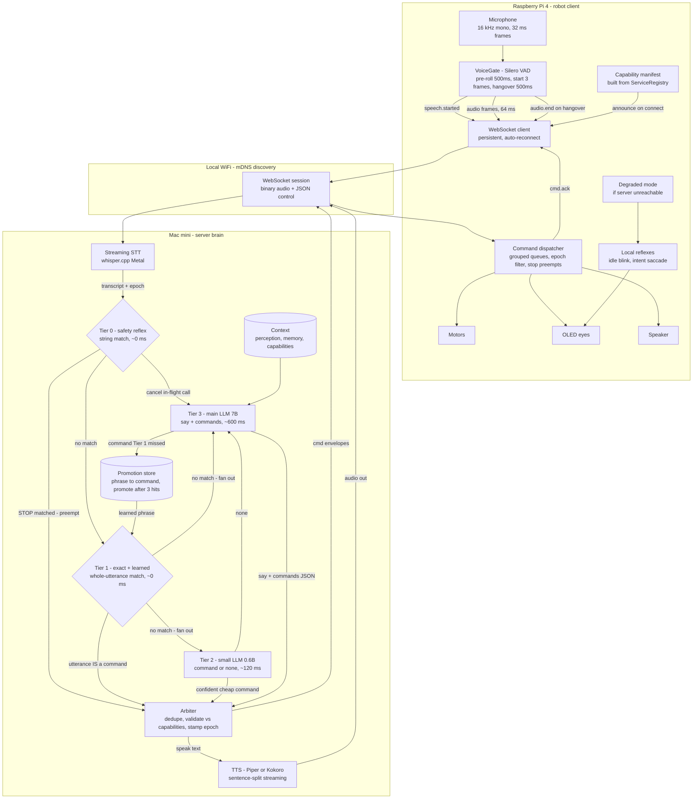

# Architecture

Eva is split across two machines. The **robot** (Raspberry Pi 4) owns hardware, reflexes and
execution. The **server** (Mac mini) owns everything expensive: speech recognition, language
models, speech synthesis. They talk over one WebSocket session on the local network.

The split exists because a Pi 4 running a language model manages a few tokens per second while
pegging the CPU that also has to drive motors — and it drains the battery faster than streaming
audio over WiFi ever would. Keeping the Pi thin is what makes Eva fast.

## The whole system

## Understanding the four tiers

An utterance escalates through tiers that get smarter and slower. Each one can end the turn, so
common cases never pay for the expensive path.

**Tier 0 — safety reflex.** Only `stop` and its synonyms, matched anywhere in the utterance.
Fires instantly and preempts: cancels the in-flight model call and clears queued movement. This is
the one place where loose substring matching is correct, because stopping unnecessarily costs far
less than failing to stop.

**Tier 1 — exact and learned match.** Fires only when the *entire* normalised utterance is a
command, after stripping politeness ("eva", "please", "can you"). "Turn left." dispatches with no
model involved at all.

**Tier 2 — small model.** A 0.6B model constrained to emit *a command or nothing* — never speech.
It catches phrasings the string tiers miss ("scoot over a bit"). It may only emit cheap, reversible
commands; anything higher-stakes waits for Tier 3.

**Tier 3 — main model.** Full context, constrained to a `say` + `commands` JSON schema.

Tiers 2 and 3 run **in parallel, not in sequence**. A router placed in front of everything would
add its latency to every dialogue turn while only helping commands — which Tier 1 already handles
for free. Racing them means a confident Tier 2 answer lets the robot react physically in ~120 ms
while Tier 3 is still composing the sentence, and the arbiter drops the duplicate if Tier 3 emits
the same command.

## Three ideas that hold the design together

**Capabilities become grammar.** The robot announces what hardware it has on connect. The server
builds its JSON schema from that manifest, so the models *cannot* emit an action the robot doesn't
have — no prompt engineering, no filtering after the fact. Add or remove hardware and the server
adapts with no code change.

**Epochs prevent stale actions.** Every transcript and command carries an epoch. When a new
utterance begins the epoch increments, and commands from older epochs are discarded — so a slow
model reply from the previous sentence never gets acted on.

**Reflexes stay local.** Idle blinking, intent saccades and obstacle stops live on the Pi. If the
server is unreachable Eva degrades to a blinking, idling robot rather than a brick.

## Inside the robot runtime

The Pi runs an event-driven graph wired together in `robot/runtime.py`. Components publish to
topics on an async bus and never call each other directly, so a slow network client can't block
audio capture.

Most components are services with `start()`/`stop()` managed by `ServiceRegistry`: start in
registration order, stop in reverse, and failures are logged without taking the robot down. That
partial-failure tolerance is what makes the modular hardware story work — a missing camera
degrades one service instead of the whole robot.

See [protocol.md](protocol.md) for the wire contract and [roadmap.md](roadmap.md) for what is built
versus planned.
