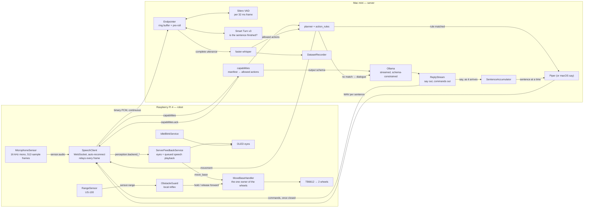

# Architecture

Eva is split across two machines. The **robot** (Raspberry Pi 4) owns hardware, reflexes and
execution. The **server** (Mac mini) owns everything expensive: speech recognition, language
models, speech synthesis. They talk over one WebSocket session on the local network.

The split exists because a Pi 4 running a language model manages a few tokens per second while
pegging the CPU that also has to drive motors — and it drains the battery faster than streaming
audio over WiFi ever would. Keeping the Pi thin is what makes Eva fast.

This page has two halves. **[What runs today](#what-runs-today)** describes the code as it exists;
**[Where this is going](#where-this-is-going)** describes the design being built toward. Nothing in
the second half is implemented yet — check [roadmap.md](roadmap.md) for the order of work.

For the call-by-call detail — which file, which function, in what order — see
[flows.md](flows.md), which traces each path as a sequence diagram.

---

## What runs today



**One turn, end to end.** The microphone publishes 32 ms frames and the SpeechClient relays every
one of them — the robot makes no judgement about what is worth hearing. On the Mac, each frame goes
to the Endpointer, which scores it with Silero VAD and keeps a rolling buffer. When speech starts,
the buffer already holds the 300 ms *before* detection, so the start of the first word is recovered
rather than clipped. When speech stops, Smart Turn decides whether the sentence actually sounds
finished; if it doesn't, the window extends and a thinking pause no longer cuts you off.

The completed utterance goes to Whisper, then to the rule matcher. A match speaks its confirmation
and sends any movement as a command. No match becomes dialogue: Ollama is asked for a reply shaped
`{"say": …, "commands": […]}`, and the tokens are streamed into a sentence accumulator, so Eva
starts talking while the rest of the reply is still being written — the spoken field is read out of
the JSON character by character rather than waiting for the closing brace. Commands parsed from the
finished object are validated and sent. The robot mutes its own microphone during playback so she
doesn't transcribe herself.

**Why the deciding happens on the Mac.** The robot used to drop quiet frames with an RMS threshold.
That put the most consequential judgement in the pipeline on the weakest CPU, using a fixed
threshold against a 1.5-second average, and it clipped word onsets — a frame is only sent *after*
it crosses the threshold, and the beginning of a word is quiet. Continuous streaming costs 32 KB/s,
which is nothing on a WiFi link, and it buys an important property: **audio that was never
discarded can still be recovered.** Pre-roll is only possible because nothing was thrown away.

**What the robot is allowed to be asked.** On connect the robot announces its sensors and
actuators, and the server answers with the subset of the action registry that hardware supports.
That subset is not advice — it is the enum in the language model's output schema, so a model
physically cannot name an action this robot lacks, and it is the argument to `validate_command()`
behind it in case one tries. A robot that sends no manifest is assumed to have everything, which is
how firmware older than the handshake keeps working unchanged.

**What is still simple.** There is one matching tier, not four. There is no arbiter and no epochs.
Commands land just after the sentence that announces them, rather than with it. Movement is
open-loop — no encoders, so Eva knows what she asked the wheels to do and nothing about what they
did, which is what blocks mapping (see
[proposals/occupancy-mapping.md](proposals/occupancy-mapping.md)).

**What is worth keeping.** Components publish to topics on an async bus and never call each other
directly, so a slow network client can't block audio capture. Services with `start()`/`stop()` are
managed by `ServiceRegistry`: started in registration order, stopped in reverse, and a failure is
logged without taking the robot down — a missing display degrades one service instead of the whole
robot. Every command reaching the wire passes `validate_command()` in `server/actions.py`, so the
registry is the single source of truth for what Eva can do, even though the models don't read from
it yet.

### Inside the robot

`robot/runtime.py` is the composition root and nothing else: it constructs the graph, registers
services, and handles shutdown. Behavior lives in services.

| Directory | Role |
|---|---|
| `core/` | Event bus, service registry, action dispatcher |
| `sensors/` | Hardware input producers — microphone, forward range |
| `perception/` | `SpeechClient` — owns the WebSocket session with the server |
| `behaviors/` | `ServerFeedbackService`, `IdleBlinkService`, `ObstacleGuard`, `MotionSafetyService` |
| `actions/` | Eye expression, animation, and `move_base` handlers |
| `display/` | `EyeController` — OLED animation primitives |
| `motion/` | `BaseDriver` — the TB6612, and the null driver that stands in for it |
| `utils/` | Logging, and `AudioOutput` — the one owner of speaker output |

**Movement has one owner.** `MoveBaseHandler` is the only thing that touches the driver, and it
holds the current motion. The server starts a movement; the obstacle reflex and the safety stops
interrupt it. Because motion is latched rather than momentary — `forward` means keep going, not go
a bit — an obstacle that clears can resume what was originally asked for, which is only possible
because one object remembers what that was.

**The reflex is local, and that is the point.** `ObstacleGuard` subscribes to `sensor.range` and
answers in the time a serial read takes. It never asks the server anything, so it is the part of
the movement path that still works when the WiFi does not. It holds *forward* motion only:
blocking every direction would park Eva against a wall with no way to leave it.

### Inside the server

`app.py` exposes the REST routes and the WebSocket endpoint; `websocket_session.py` runs one
session. Listening is split across three files: `voice_activity.py` (is this frame speech?),
`turn_detection.py` (has the speaker finished?) and `endpointing.py` (the buffer and the decision).
`planner.py` decides commands-versus-dialogue, `action_rules.py` holds the phrase rules, and
`actions.py` is the registry every command is validated against. `capabilities.py` reads the
robot's manifest and decides how much of that registry this session may use. `reply_stream.py`
separates the spoken half of a model reply from the commands, and `sentences.py` cuts the spoken
half into speakable pieces.

The detectors are injected into the endpointer rather than constructed by it, which is what lets
the endpointing logic be tested with fakes in milliseconds and no model files. `make models`
fetches the ~10 MB of ONNX weights; without them the server still runs, treating every frame as
speech and ending turns on silence alone, and says so in the log.

### Who decides what

Exactly **two** of the server's twenty modules know a network exists:

```
$ grep -ln "WebSocket\|send_bytes\|send_text" server/*.py
app.py
websocket_session.py
```

`app.py` declares the route. `websocket_session.py` runs the session and owns three things, and
only these three:

1. **Transport** — the only place `receive()`, `send_text()` and `send_bytes()` appear.
2. **Per-connection state** — the endpointer, `frame_carry`, `ignore_until`, and this robot's
   capabilities.
3. **Orchestration** — the order the stages run in.

That third one is worth stating precisely, because it is easy to assume the session decides more
than it does. It sequences the work; it makes none of the judgements.

| Decision | Made in |
|---|---|
| Is this frame speech? | `voice_activity.py` |
| Has the speaker finished? | `turn_detection.py` |
| Where does the utterance start and end? | `endpointing.py` |
| What were the words? | `speech_to_text.py` |
| Command or conversation? | `planner.py`, `action_rules.py` |
| What can this robot be asked to do? | `capabilities.py`, `actions.py` |
| Is this command legal? | `actions.py` — `validate_command()` |
| Which part of a reply is speech? | `reply_stream.py` |
| Where does a spoken sentence end? | `sentences.py` |
| *In what order all of the above happens* | `websocket_session.py` |

Everything below the session is a plain function of its input: give it audio, get text; give it
text, get a plan. None of them can reach the socket, so none of them can be tested only through
one. That is why `test_endpointing.py` runs the real endpointing logic against fake detectors in
40 ms without opening a connection, and why swapping Piper for `say`, or Silero for the always-on
fallback, changes no calling code.

**The seam that moves next.** Orchestration is the responsibility that will strain first.
`_finalize_utterance()` is around thirty-five lines today and reads top to bottom. The tier design
below routes tier-0 preemption, a parallel tier-2/3 race and an arbiter through that same
function, and it will not survive that. At which point orchestration earns its own object — a
`Turn` owning one utterance's journey — leaving `websocket_session.py` with transport and session
state alone. Worth doing when tiers arrive, not before.

---

## Where this is going

None of this exists yet. It is recorded here because the shape of the code today — the registry,
the manifest, the event bus, the validated command envelope — is chosen to make these additions
cheap. Capabilities-as-grammar used to be the first item on this list; it is now in
[what runs today](#what-runs-today), and the rest of the list assumed it.

**Four tiers instead of one.** An utterance would escalate through tiers that get smarter and
slower, each able to end the turn:

- **Tier 0 — safety reflex.** Only `stop` and synonyms, matched anywhere in the utterance. Preempts:
  cancels the in-flight model call and clears queued movement. Loose substring matching is correct
  here, because stopping unnecessarily costs far less than failing to stop.
- **Tier 1 — exact and learned match.** Fires when the *entire* normalised utterance is a command,
  after stripping politeness. This is roughly what `action_rules.py` does today.
- **Tier 2 — small model.** A 0.6B model constrained to emit a command or nothing, never speech.
  Catches phrasings the string tiers miss, limited to cheap reversible commands.
- **Tier 3 — main model.** Full context, constrained to a `say` + `commands` schema.

Tiers 2 and 3 would run **in parallel, not in sequence**. A router in front of everything would add
its latency to every dialogue turn while only helping commands — which Tier 1 already handles for
free. Racing them lets a confident Tier 2 answer move the robot while Tier 3 is still composing a
sentence, with the arbiter dropping the duplicate. Worth measuring the real command-to-dialogue
ratio before building Tier 2 at all.

**Epochs prevent stale actions.** Every transcript and command carries an epoch that increments
when a new utterance begins; commands from older epochs are discarded, so a slow reply to the
previous sentence never gets acted on.

**Barge-in.** Eva currently goes deaf while speaking, which is the only way to avoid transcribing
herself without acoustic echo cancellation. Real interruption needs AEC, and then the endpointer
already has what it needs to detect that you have started talking over her.

**Reflexes stay local.** Idle blinking and the obstacle stop already are. Intent saccades would
join them, so an unreachable server degrades Eva to a blinking, idling robot rather than a brick.

**Streaming transcription is deliberately *not* on this list.** LocalAgreement-style streaming ASR
confirms a prefix only once consecutive decodes agree, which costs latency; a batch decode of a
2–3 s utterance is a few hundred milliseconds on an M2. For short conversational turns it would
make Eva slower, not faster. It earns its place in long-form dictation, which is not this.

See [protocol.md](protocol.md) for the wire contract and [roadmap.md](roadmap.md) for the order of
work.
