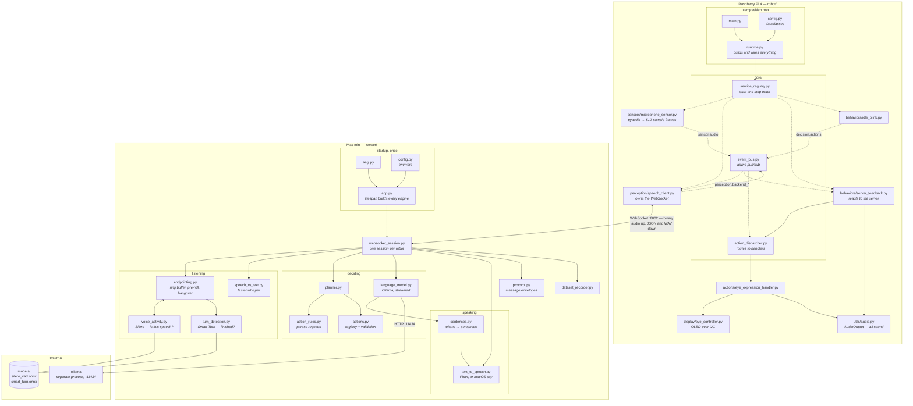
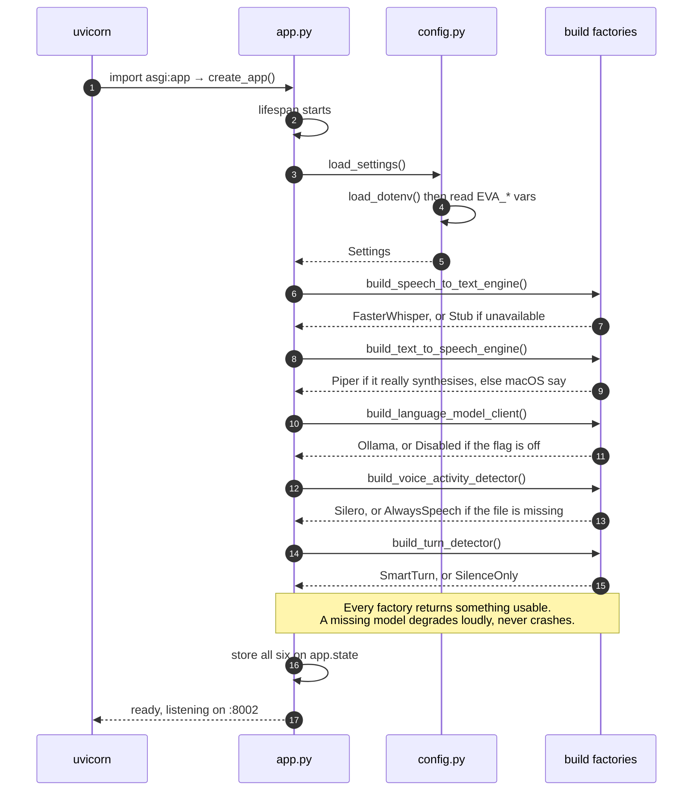
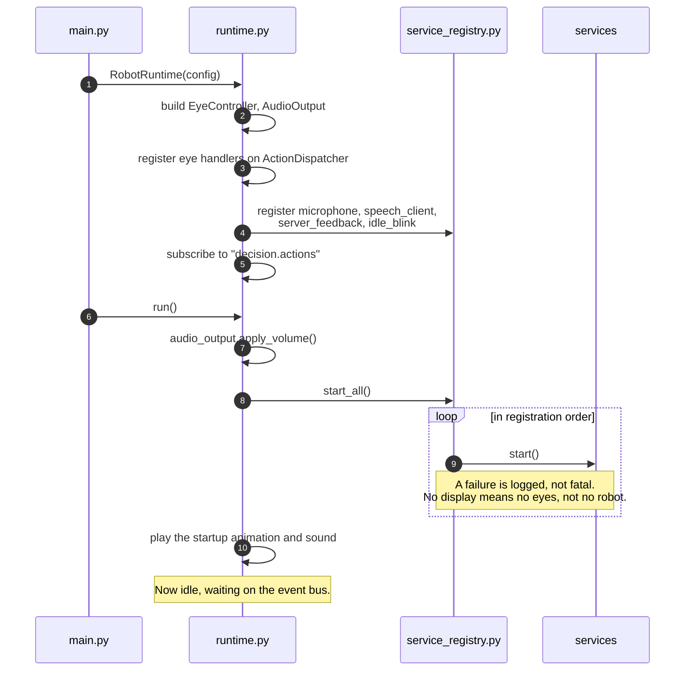
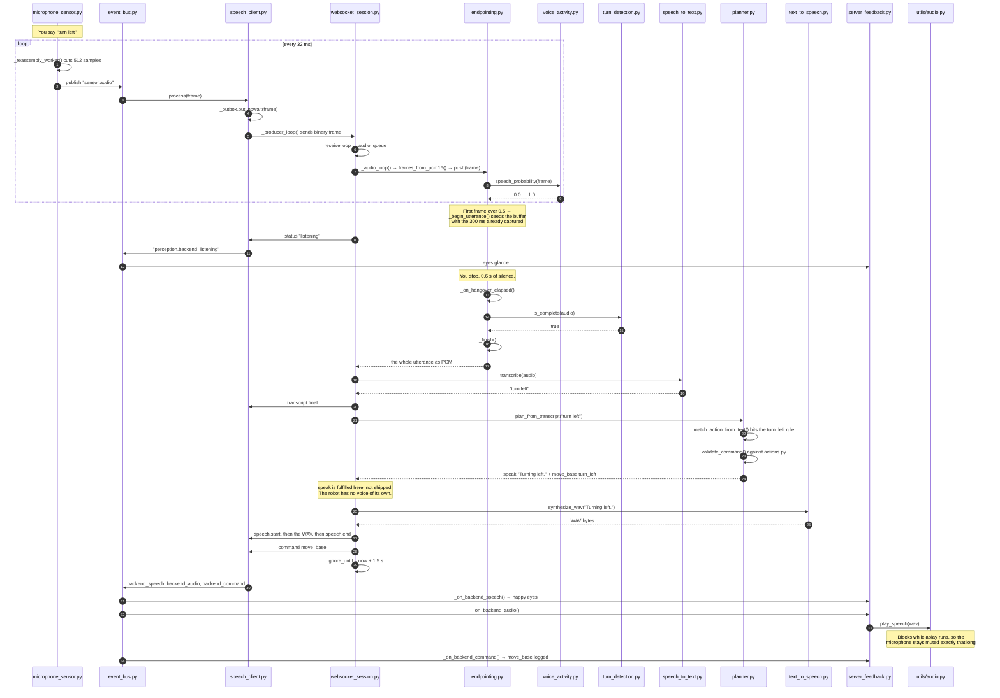
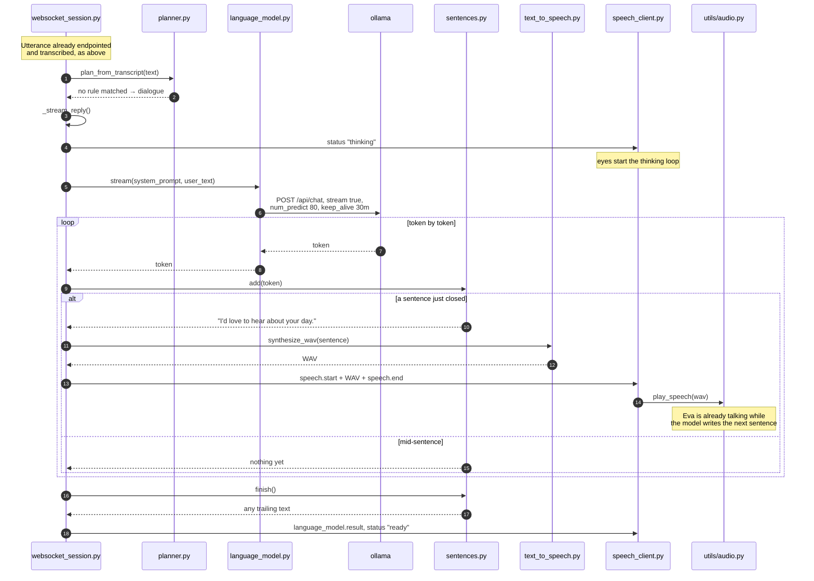
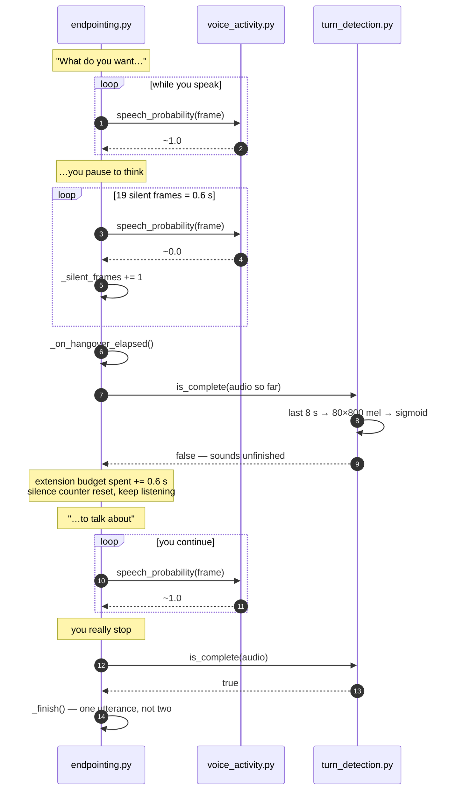
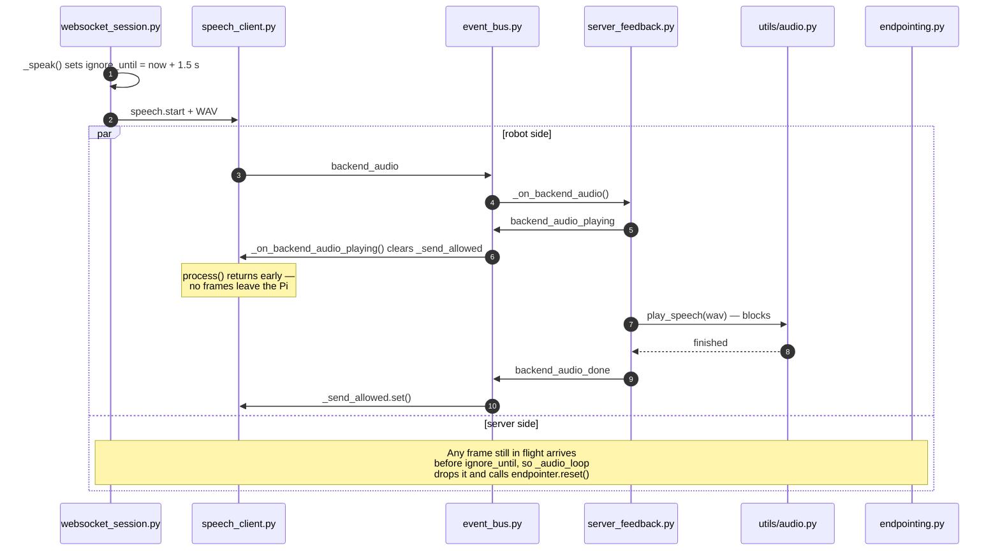
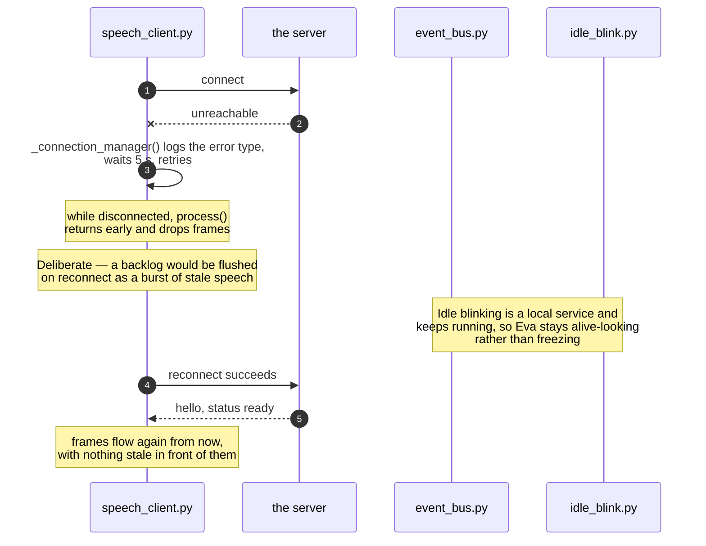

# How Eva works, step by step

Every diagram here names real files and real functions. If a box says
`endpointing.py · push()`, that function exists and is on the path.

For the shape of the system and the reasoning behind it, read
[architecture.md](architecture.md). This page is the wiring.

- [The components](#the-components)
- [Startup — the server](#startup--the-server)
- [Startup — the robot](#startup--the-robot)
- [A command: "turn left"](#a-command-turn-left)
- [A conversation: "what do you want to talk about"](#a-conversation-what-do-you-want-to-talk-about)
- [A thinking pause](#a-thinking-pause)
- [Not hearing herself](#not-hearing-herself)
- [Losing the server](#losing-the-server)

---

## The components

Two processes on two machines, one WebSocket between them. Dotted arrows are
the event bus; solid arrows are direct calls or network traffic.

Note where the models live: `silero_vad.onnx` and `smart_turn.onnx` are files
loaded **inside the server process** by onnxruntime. Only the chat model is a
separate service.

---

## Startup — the server

Runs once, before any robot connects. Building Whisper and the ONNX sessions is
slow, so it happens here and the results are shared by every connection.

---

## Startup — the robot

---

## A command: "turn left"

The fast path. A rule matches, so no language model is involved at all.

---

## A conversation: "what do you want to talk about"

No rule matches, so it becomes dialogue — and the reply is spoken while it is
still being written.

---

## A thinking pause

Why a 600 ms pause mid-sentence no longer cuts you off.

If the detector never says "finished", `max_extension_seconds` (4 s by default)
ends the turn anyway, so a noisy room cannot hold the microphone open forever.

---

## Not hearing herself

Eva's speaker is centimetres from her microphone, so her own voice comes
straight back in. Two mechanisms, one per side.

The server-side guard exists because frames already in the socket buffer cannot
be recalled — muting the Pi stops new audio, not audio already sent.

---

## Losing the server

---

## Where to look when something breaks

| Symptom | Start here |
|---|---|
| Sentences cut short | `endpointing.py` — hangover and turn detection |
| First word missing | `endpointing.py` — `preroll_seconds` |
| Nothing transcribed | `voice_activity.py` — is the model loaded? check the startup log |
| Eva never replies | `EVA_LANGUAGE_MODEL_ENABLED`, and whether the Ollama model name exists |
| Wrong voice | `text_to_speech.py` — the startup log says `piper` or falls back to `say` |
| Too quiet or too loud | `robot/config.py` — `AudioConfig.volume_percent` |
| Eva talks over herself | `ignore_until` in `websocket_session.py`, `_send_allowed` in `speech_client.py` |
